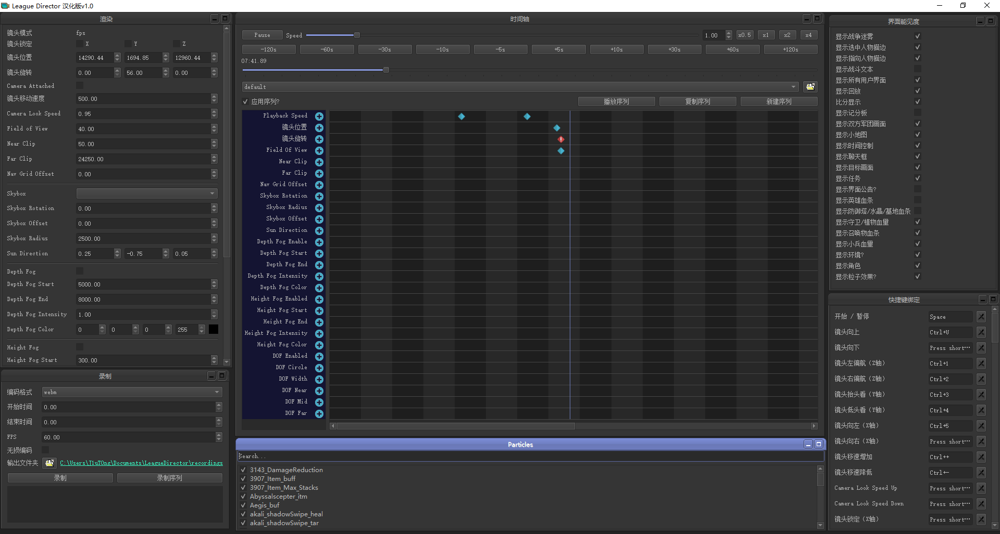

## League Director汉化版
[](https://github.com/riotgames/leaguedirector/blob/master/LICENSE)
[](https://www.python.org/downloads/release/python-372/)
[](https://www.qt.io/qt-for-python)
[]()

League Director是一款用于录制编辑英雄联盟录像的工具. **[下载最新版](https://github.com/J1uT0ng/leaguedirector/releases/latest)**



## 特点

* 可以控制录像回放和速度
* 第一人称镜头控制
* 镜头可以对焦英雄或者小兵
* 切换界面元素，包括HUD，血条和界面通知
* 图形选项
  - 视角
  - Near and far clipping
  - Custom skyboxes
  - 阴影方向
  - 战争迷雾的深度和高度
  - 景深
* Sequencer
  - 记录和回放关键帧相机位置+图形选项
  - 用于查看和编辑关键帧值的时间线
  - 撤消/重做
  - 保存和加载预先保存的序列
  - Adjustable keyframe blending
* 可以捕获WebM或PNG格式
* 自定义快捷键绑定

## 使用方法

**注意: 仅支持Windows系统**

1. **[下载League Director汉化版](https://github.com/J1uT0ng/leaguedirector/releases/latest)** 并安装。
2. 启动League Director汉化版，并确保准备就绪界面下方的复选框已经勾选。
3. 打开一个录像文件，League Director汉化版会自动连接到客户端。
4. 在游戏界面中按下ESC打开菜单页面，保证视频图形质量设置为“极高”。如果需要修改的话，请重新启动League Director汉化版。
5. 在游戏左下角的下拉列表中选择FPS Camera。
6. 您可以通过使用数字键盘上的数字键（4、5、6、8）和鼠标自由移动相机。 游戏内设置选项也可以更改键盘绑定。

## 详解
介绍 | 上手
------------ | -------------
[](B站链接 "League Director汉化版介绍")|[](B站链接 "League Director 汉化版使用教程")

**League Director汉化版连接不上我的录像？**

如果不能找到并配置你的客户端，不用担心，你可以手动配置。 首先打开游戏安装路径, 然后在game\config目录下找到“game.cfg”的文件，右键用记事本打开该文件，复制查找关键词EnableReplayApi，并将该值设置为1。如果找不到该关键词，请将下面这行代码添加到'[General]'部分中。重新打开League Director汉化版，将会生效。
```
EnableReplayApi=1
```

## 特别感谢
 * RiotGames leaguedirector
